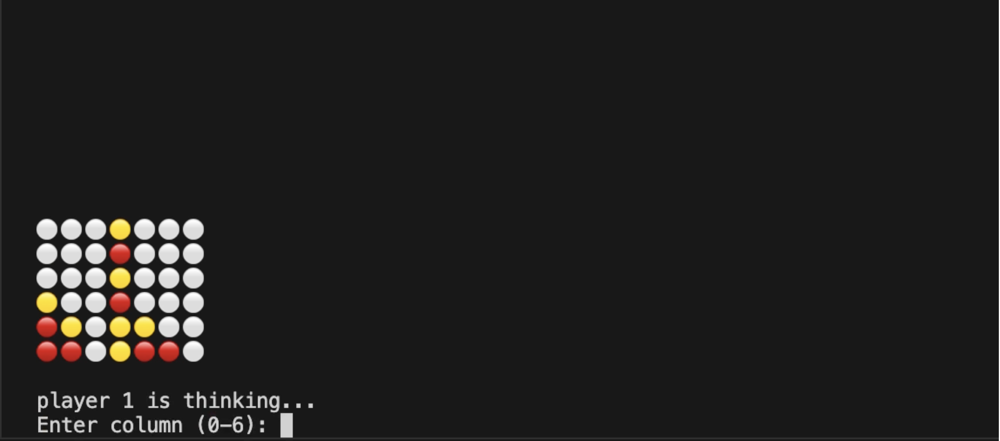

# ConnectFour Minimax AI w/ Alpha Beta Pruning

Terminal implementation of Connect Four that uses the minimax algorithm for optimal decision-making. Alpha-beta pruning is used to improve efficiency by reducing the number of game states explored.

### Demo

## Features

- Minimax algorithm with alpha-beta pruning for optimal decision making
- Custom evaluation function (offensive + defensive heuristics)
- Random player (baseline)
- Human player (terminal input)
- Tournament simulation for benchmarking AI performance

## Project Structure

- **play.py**: Handles game execution and simulation between two player functions. Supports both interactive play (human vs AI) and automated tournaments for evaluating player performance over multiple rounds.

- **players.py**: Contains all player implementations, including the minimax-based AI (with alpha-beta pruning), a random player for baseline comparison, and a human player that takes terminal input for interactive testing. Also includes the evaluation function and helper methods used to score board states.

- **connectfour.py**: Implements the core Connect Four game mechanics, including board representation, move execution, and win condition checks (rows, columns, and diagonals). Also provides helper functions for determining valid moves and checking whether the game has ended.
 
- **test.py**: Contains unit tests for validating core game logic and helper functions, including move placement, win detection, and evaluation-related utilities.

## To run

Run the game:
python play.py

You can choose different player types inside play.py:
- ai_player_fn (minimax AI)
- random_player_fn
- human_player_fn (terminal input)

Play a single game:
play_game(human_player_fn, ai_player_fn)

Run a tournament (AI vs random):
play_tournament(ai_player_fn, random_player_fn, 100)

## Notable design-choices

* Board is represented as a 1D list (size 42)
* Moves mutate the board and must be undone during search
* Slightly higher penalty is given to opponent threats → more defensive AI in the evaluation function
